<div align="center">

# 🐝 Buzz

### One feed. Ask for help, give a hand.

**A broken AC. An hour of tutoring. A project missing an Arduino person.**
On Buzz they're the same kind of post — an **Ask** or a **Give** — in one
shared feed, with one wallet and one reputation score behind them.

<br />


**100 tests passing · 23 routes · zero shadcn**

</div>

---

<div align="center">

<!-- 📸 Replace with a screenshot of the landing hero -->
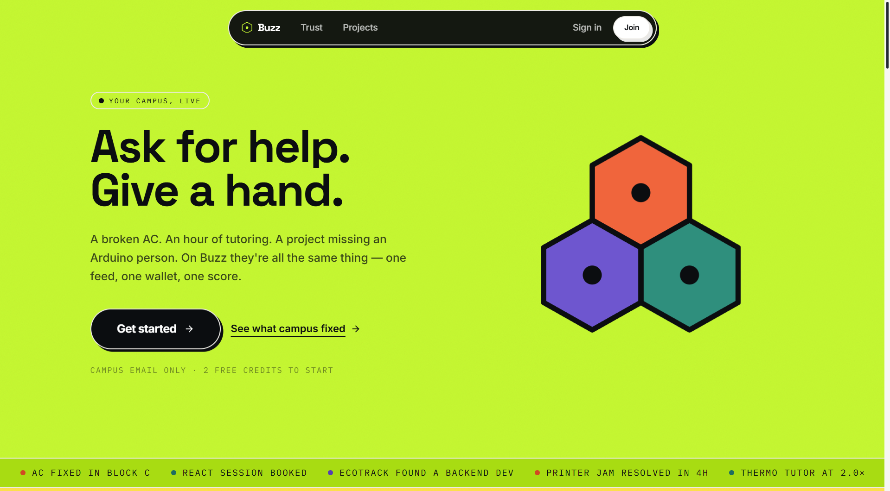

</div>

---

## The problem

Three real campus problems sit underneath Buzz:

| | |
|---|---|
| 🔧 **Campus** | Broken things vanish into WhatsApp with no tracking, no SLA, and no way to know if anyone's seen it — so students stop reporting. |
| 🎓 **Skills** | Enormous peer expertise sits untapped because there's no non-awkward, non-monetary way to trade help. |
| 🚀 **Builds** | Every year hundreds of projects get built, presented once, and disappear into a PDF nobody can find again. |

**But the real problem is fragmentation.** Build three separate tools and
most people only ever open one — a student who only has facility complaints
has no reason to ever visit a "skills" tab.

## The answer

> **One `posts` table. One lifecycle. One feed.**

A maintenance report, a tutoring session and a vacant seat on a startup team
are the **same row** in the same table, differentiated by a `category` and a
JSONB blob. They walk the same status graph and leave the same audit trail.

That's why the wallet, the score and the feed can be *genuinely* shared
rather than three things stapled together — and why someone who came to
report a broken tap scrolls past a tutor and a teammate on the way out.

```
open ──▶ accepted ──▶ in_progress ──▶ fulfilled ──▶ verified
                                          │
                                          └──▶ reopened ──┐
                                                          ▼
                                                      cancelled
```

---

## ✨ Features

### The shared spine

- **One mixed feed** (`/feed`) — all three categories in one ranked list.
  Filter chips narrow it; they don't switch between three apps.
- **Smart ranking** — recency decay plus additive boosts for proximity
  (Campus), matching skill tags (Skills), required-role tags matching what
  you've offered (Builds), your department, and your own threads someone is
  waiting on. **Every term is additive on top of recency**, so a brand-new
  user with no location, skills or department still gets a sensible feed.
- **One compose flow** — Ask or Give → category → the 3–4 fields that
  category actually needs. No separate "report an issue" form.
- **Immutable audit trail** — every status change appends to `post_events`.
  Never updated, never deleted.
- **Realtime** — Postgres `LISTEN/NOTIFY` → SSE, with a polling fallback for
  hosts that don't expose it. The nav shows which transport is live.

### 🔧 Campus

- Photo, map pin (real lat/lng, real distance ranking), urgency
- **Live SLA countdown** — 12h / 48h / 120h by urgency, frozen once resolved
- **Verify with an after-photo** — enforced server-side; a Campus report
  physically cannot close without proof
- **Recurring-issue detection** — same location + same fault ≥3× in 30 days
  gets flagged as a maintenance failure, not three unrelated reports
- **Anonymous sensitive reports** — visible *only* to the Safety Officer and
  the reporter. Not to staff. **Not to platform admins.** Enforced in SQL.

### 🎓 Skills

- Two-directional: post a Give (list a skill) or an Ask (request help)
- **2 starter credits** on signup — as a real ledger entry, not a magic
  default, so every balance reconciles against its own ledger
- **Escrow** — credits lock on accept, release on dual confirmation, refund
  automatically if the work falls through
- **Scarcity Index** — a live per-skill credit multiplier from supply vs
  demand. Teaching something nobody else offers pays more.
- Reviews feeding the unified score

### 🚀 Builds

- Project pages: type, department, year, tech tags, repo/demo/report links
- **Pipeline** — Idea → Prototype → Validated → Incubated → Launched, with
  stage history written into the *same* `post_events` trail as everything else
- **Teammate discovery with no separate mechanism** — posting an open role
  creates an ordinary Ask, and the shared ranking surfaces it to people whose
  Skills posts carry those tags. `/builds/[id]/team` shows you who that will
  be *before* you post it.
- Searchable public archive — department, year, type, stage, tech tag
- Milestones, comments, mentorship requests

### 🏆 Cross-cutting

- **One Buzz Score** — a single number summed across all three categories,
  shaded ±10% by review ratings. Not three sub-scores next to each other.
- **One wallet, one ledger** — every movement including escrow legs, with a
  live reconciliation check on `/wallet`
- **Public Trust dashboard** — resolution rates, SLA compliance, credit
  velocity, pipeline funnel. The numbers that look bad are there too.
- **Verified Contributions export** — a printable record of everything you
  completed, for job hunting
- **Onboarding + in-app tour** — four panels explaining Ask/Give, then coach
  marks anchored to real elements on the feed
- **RBAC across 5 roles** — student, staff, admin, safety, mentor. Enforced
  at the query layer, with the role read from the database per request so
  revoking access is immediate.

---

## 📸 Screenshots

> Replace these with your own — the paths are ready.

<table>
<tr>
<td width="50%">

**Landing — scroll-driven**
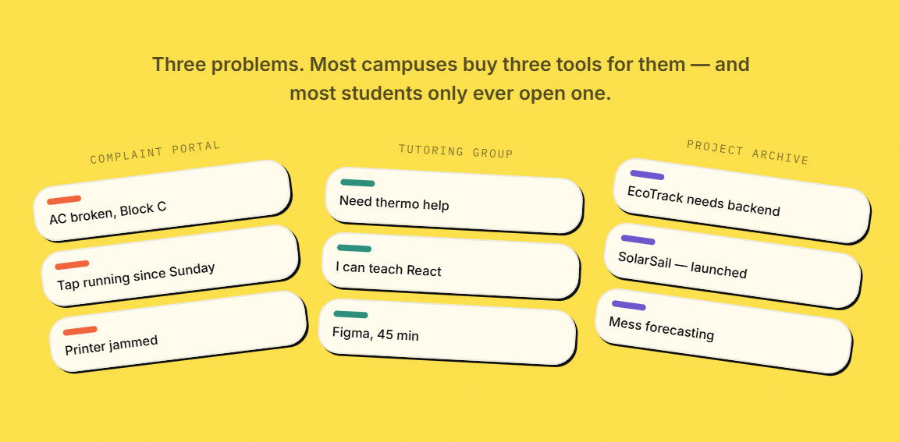

</td>
<td width="50%">

**The feed — all three categories**
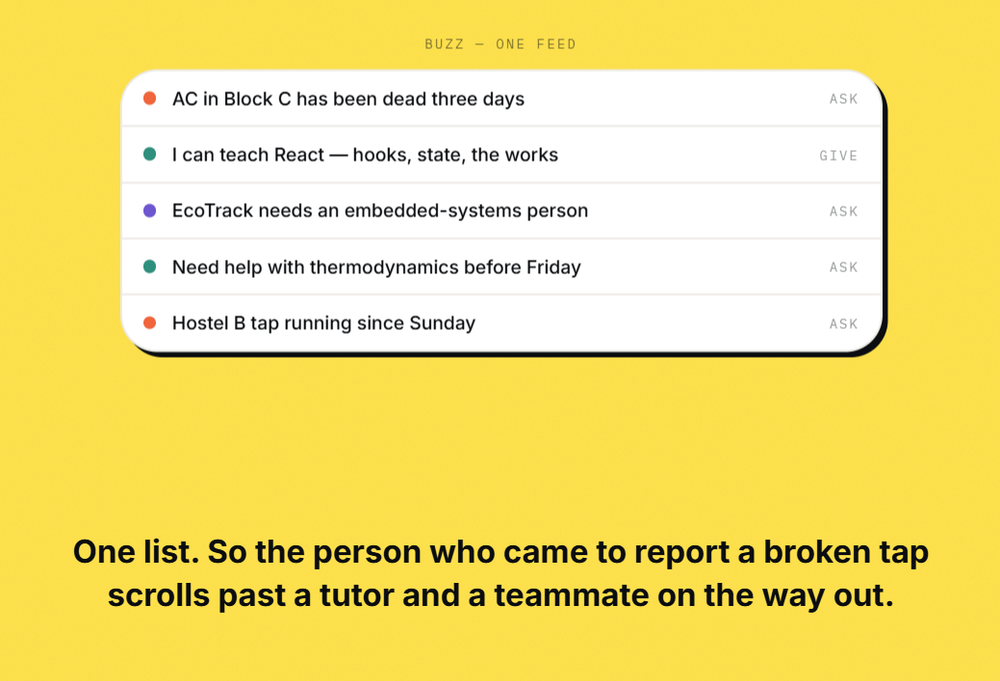

</td>
</tr>
<tr>
<td width="50%">

**Onboarding**
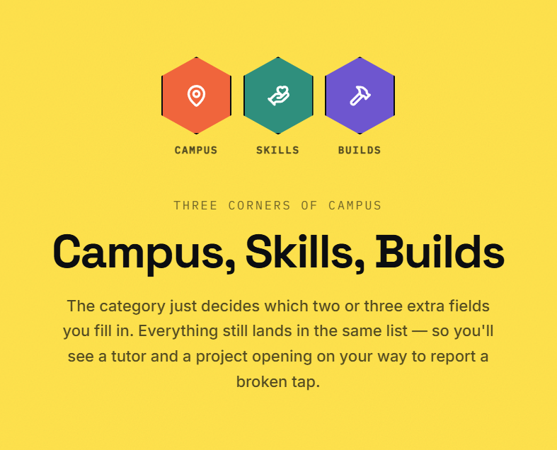

</td>
<td width="50%">

**Dashboard tour**
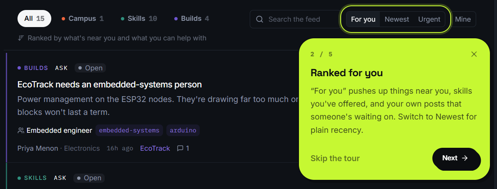

</td>
</tr>
<tr>
<td width="50%">

**Post detail — lifecycle + audit trail**
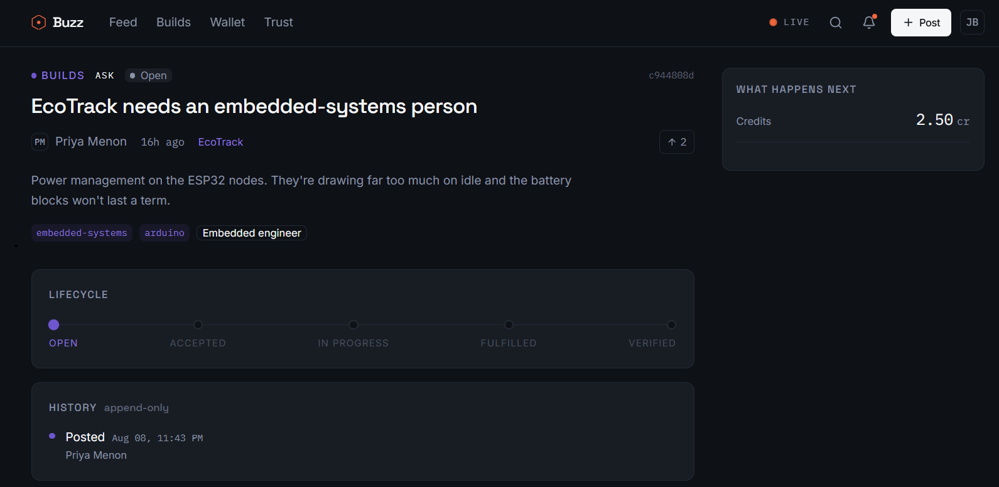

</td>
<td width="50%">

**Profile — one Buzz Score**
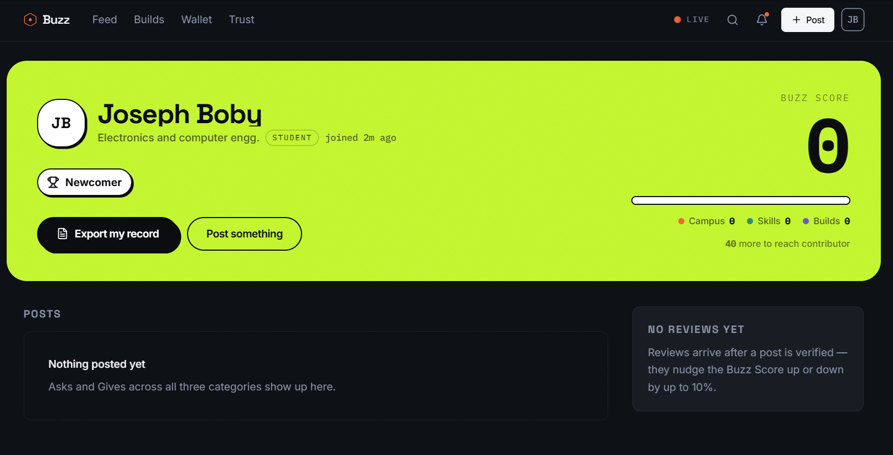

</td>
</tr>
<tr>
<td width="50%">

**Wallet — ledger + Scarcity Index**
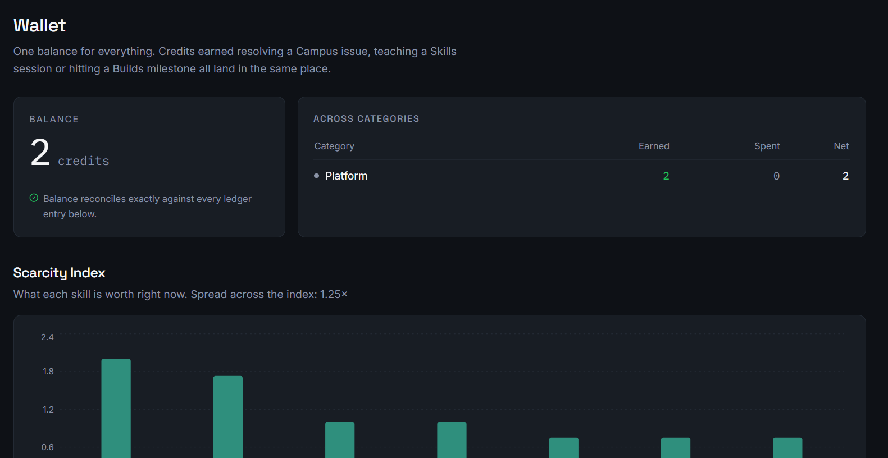

</td>
<td width="50%">

**Trust dashboard — public**
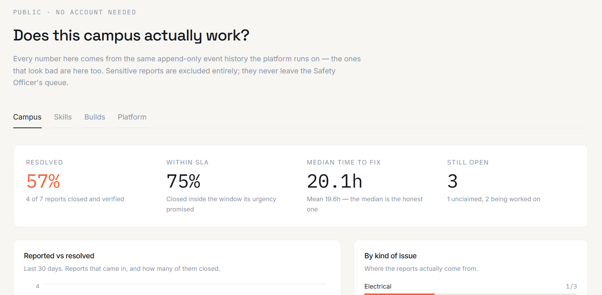

</td>
</tr>
<tr>
<td width="50%">

**Builds archive**
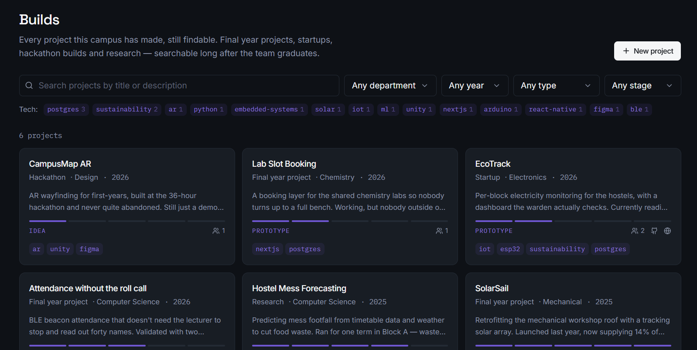

</td>
<td width="50%">

**Admin console**
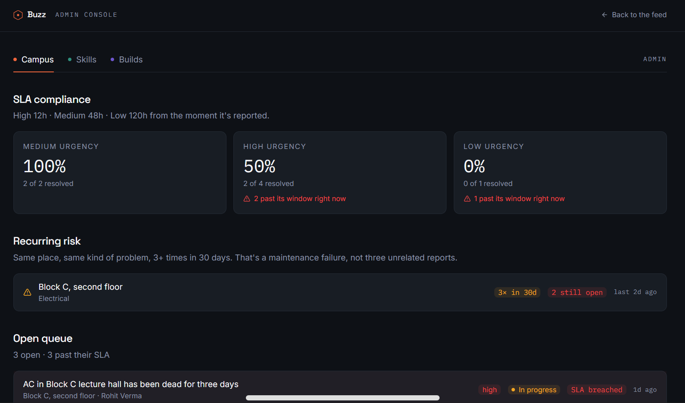

</td>
</tr>
</table>

---

## 🚀 Run it locally

**Needs:** Node 20.11+ and Docker (for Postgres).

```bash
npm install
cp .env.example .env
```

Set two things in `.env`:

```bash
# 1. A real secret
AUTH_SECRET=<paste output of the command below>

# 2. Your college's domain — subdomains are automatic, so
#    `sjcetpalai.ac.in` also admits `you@es.sjcetpalai.ac.in`
CAMPUS_EMAIL_DOMAINS=buzzcampus.edu,sjcetpalai.ac.in
```

```bash
node -e "console.log(require('crypto').randomBytes(32).toString('base64'))"
```

> Keep `buzzcampus.edu` in the list while developing — the seeded demo
> accounts live there.

Then:

```bash
docker compose up -d     # Postgres :5432, throwaway test DB :5433
npm run db:migrate       # create the tables
npm run db:seed          # a campus with a month of history in it
npm run dev              # → http://localhost:3000
```

### Demo accounts

All use the password **`buzz1234`**.

| Email | Role | Worth seeing |
|---|---|---|
| `aisha@buzzcampus.edu` | student | The ordinary case — active in two categories |
| `priya@buzzcampus.edu` | student | Leads EcoTrack; open roles and the pipeline |
| `joseph@buzzcampus.edu` | staff | The Campus queue and SLA breaches |
| `kavitha@buzzcampus.edu` | safety | The only role that can see sensitive reports |
| `rebecca@buzzcampus.edu` | mentor | The Builds console |
| `admin@buzzcampus.edu` | admin | All three admin consoles |

> **Try this:** sign in as `admin` and search the feed for the anonymous
> lighting report — it isn't there. Sign in as `kavitha` and it appears.
> That exclusion is enforced in SQL, not hidden in a component.

---

## 🧪 Commands

| Command | |
|---|---|
| `npm run dev` | Dev server with hot reload |
| `npm run build` | Production build |
| `npm test` | 100 tests |
| `npm run typecheck` | Typecheck every package |
| `npm run db:generate` | Generate a migration from schema changes |
| `npm run db:migrate` | Apply pending migrations |
| `npm run db:seed` | Wipe and reseed — **destroys local data** |
| `npm run db:studio` | Browse the data in Drizzle Studio |

### Tests — two layers, on purpose

```bash
npm test
```

- **Pure unit tests** (always run) — the status graph, authorisation rules,
  escrow rules, credit arithmetic, the scarcity curve, SLA maths, the
  sensitive-report policy, campus-email matching.
- **Transactional tests** (run when `TEST_DATABASE_URL` is set) — row
  locking, ledger rows, escrow round-trips, concurrent-spend serialisation,
  against real Postgres. They skip cleanly without a database, so `npm test`
  passes on a fresh clone.

The two functions carrying the most correctness risk — `transitionPost()` and
`transferCredits()` — are covered at **both** layers.

---

## 🏗️ Architecture

```
apps/web/           Next.js 15, App Router. Routes and UI only —
                    almost no business logic.
  server/           tRPC routers, context, Auth.js config
  components/       app-specific composites
  lib/              tRPC wiring, GSAP setup, the SSE hook

packages/db/        Drizzle schema + client. Lowest layer, no
                    internal dependencies.
packages/core/      transitionPost, transferCredits, ranking, scarcity,
                    the Buzz Score, RBAC policy, Zod schemas, tests.
                    Imports packages/db; nothing else.
packages/ui/        The design system on Radix primitives. Presentation
                    only — never imports db or core.

scripts/            seed + migrate. Compose db + core, so they sit
                    above both.
```

Package boundaries are **real constraints**, not aspirations — see
[`docs/ARCHITECTURE.md`](docs/ARCHITECTURE.md).

`@buzz/core` is the server surface; `@buzz/core/client` is the isomorphic
subset (constants, money maths, Zod schemas, SLA maths). Client Components
import the latter — importing the root barrel from the browser would drag the
Postgres driver into the bundle.

### The two functions everything routes through

**`transitionPost()`** — the only way a post's status ever changes. One
transaction: lock the row, check the move is legal *and* that this actor may
make it, append an immutable event, update the status, then run the
consequences (escrow, contribution points) **in that same transaction**. If
the status moved, those ran.

**`transferCredits()`** — the only way a balance ever changes.
`SELECT … FOR UPDATE` on both wallets, so concurrent spends serialise instead
of double-spending. Escrow is modelled as a transfer to/from `null` (the
platform), keeping one primitive instead of three, and every movement leaves
a ledger row — so any balance is reconstructible by replaying its own ledger.

> There is no `UPDATE posts SET status` or `UPDATE wallets SET balance`
> anywhere else in the codebase. Grep for them.

---

## 🎨 Design

Two registers, deliberately:

**Entry surfaces** — landing, onboarding, auth, the tour, empty states — use
saturated flat colour panels, heavy black type, chunky pill buttons with a
hard offset shadow, and scroll-linked motion.

**Working surfaces** — feed, post detail, wallet, admin — keep a readable
dark ground and use colour to *mean* something (which category, whether an
SLA has breached). A full-bleed acid-green panel behind an SLA table is
unreadable, and the feed is where people actually live.

**No shadcn/ui.** Every component is built from scratch on Radix primitives
against the tokens in `apps/web/tailwind.config.ts`. Full rationale and the
banned-patterns list: [`docs/DESIGN_SYSTEM.md`](docs/DESIGN_SYSTEM.md).

**Motion split** — Framer Motion for component state (onboarding panels,
coach marks, the lifecycle timeline); GSAP + ScrollTrigger for scroll-linked
timelines. Entrance animations are CSS, so an interrupted timeline can never
strand content invisible. Everything respects `prefers-reduced-motion`.

---

## 📦 Stack

Next.js 15 (App Router, RSC) · tRPC v11 · TanStack Query · Drizzle ORM ·
PostgreSQL · Auth.js v5 · Zod · Tailwind · Radix UI primitives ·
Framer Motion · GSAP · Recharts · Vitest

---

## 🌍 Deploying

Full guide, including Coolify step by step: **[`HOWTOHOST.md`](HOWTOHOST.md)**

Short version — the `Dockerfile` works anywhere that builds images (Coolify,
Railway, Fly, a bare VPS). Migrations apply automatically at container start.

```bash
docker build -t buzz .
docker run -p 3000:3000 \
  -e DATABASE_URL=... \
  -e AUTH_SECRET=... \
  -e CAMPUS_EMAIL_DOMAINS=yourcollege.ac.in \
  buzz
```

`/api/health` checks Postgres as well as the process, so a deploy that comes
up without a working database is correctly reported as failed rather than
going green and serving errors.

---

## 📋 Known gaps

An honest list rather than a claim of completeness:

- **Photos are URLs, not uploads.** The compose flow and verify dialog take
  image URLs. Wiring Vercel Blob or S3 behind those fields is contained — the
  schema and UI already carry them.
- **The daily digest is pull, not push.** It's computed and shown in the
  notification panel; nothing emails it.
- **Recurring-issue detection flags, it doesn't escalate.** Auto-escalation on
  SLA breach is a PRD stretch goal and isn't built.
- **No map tiles.** Campus posts carry lat/lng and rank on real distance, but
  the pin is captured via browser geolocation rather than picked off a map.
- **`builds.pipelineStage` uses a stage-marker post** to write into the shared
  `post_events` trail rather than a separate table. Deliberate — it keeps one
  audit trail, at the cost of one synthetic post per project.

---

## 📚 Docs

| | |
|---|---|
| [`docs/PRD.md`](docs/PRD.md) | Full product requirements and rationale |
| [`docs/ARCHITECTURE.md`](docs/ARCHITECTURE.md) | Monorepo structure and package boundaries |
| [`docs/DESIGN_SYSTEM.md`](docs/DESIGN_SYSTEM.md) | Visual language, tokens, banned patterns |
| [`docs/BUILD_PLAN.md`](docs/BUILD_PLAN.md) | Phase checklist and what was built differently |
| [`HOWTOHOST.md`](HOWTOHOST.md) | Local + Coolify deployment |

---

<div align="center">

**The number that matters**

`% of users with a completed post in 2+ categories`

If Buzz were three tools in a trench coat, that number would be near zero.
It's on the Trust dashboard, and it's the one worth arguing about.

</div>
